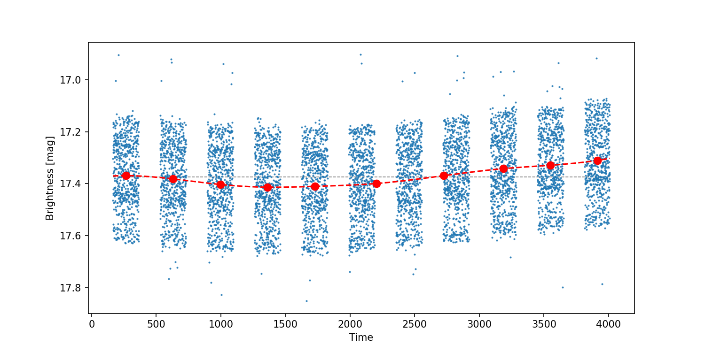
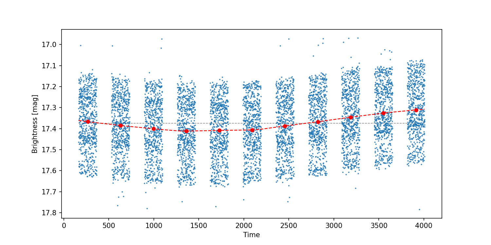
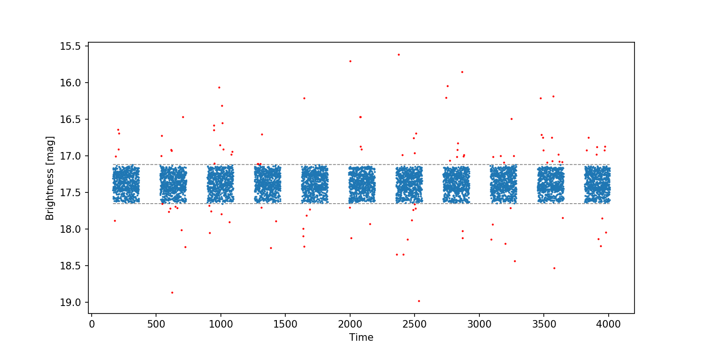

# Usage

To see how to use **variability-analyser** properly we'll perform an analysis of a synthetic data. At the beginning check [how to prepare](https://github.com/pbrus/variability-analyser/tree/master/doc/configuration.md) a `config` file. In this tutorial we use a default `config` file which is attached to the repostiory and is ready to use after installation. To demonstrate consecutive steps we'll use a synthetic time series of RR Lyrae variable.

## Data preparation

Let's prepare the data firstly. We call the main script to remove a trend:
```bash
var_analyser.sh lightcurves/rr_lyr_lc.dat
```
We get an image of the time series and a spline with 9 (default) nodes marked by red dots:



A spline describes the trend between observational seasons. The script asks us:
```
Is OK? [y/n]:
```
We can change the number of nodes. If we type `n` then `11`, we get the following fitting:



It seems to be right. In the next step the software will remove the trend and perform sigma clipping on the time series automatically. After that an interactive window will appear. If the result is not satisfactory, we can improve it just clicking on the windows twice. All points lying outside two horizontal lines will be removed and marked red:



According to the `config` file, two new directories will be created in the current directory:

+ `lightcurves_detrend/`
+ `lightcurves_trim/`

The directories store text files of modified time series and PNG images of final data preparation.

> :point_right: **_NOTE:_** If we break the program's flow at this moment, the next call of `var_analyser.sh` will reuse these files.

## Variability analysis

Now we are ready to start the main analysis.
