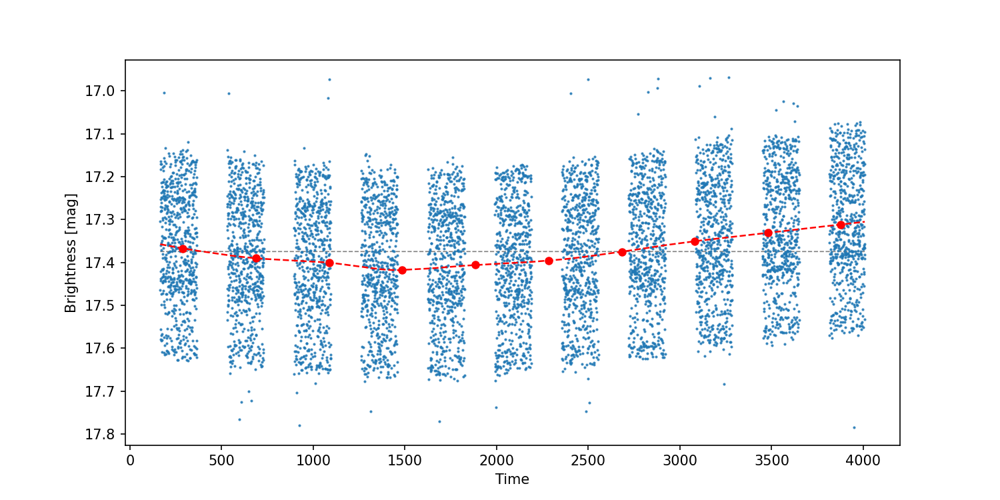

# Usage

To see how to use **variability-analyser** properly we perform an analysis of a synthetic data. At the beginning check [how to prepare](configuration.md) a `config` file. In this tutorial we use a default `config` file which is attached to the repostiory and is ready to use after installation. To demonstrate consecutive steps we use a synthetic time series of RR Lyrae variable.

## Data preparation

Let's prepare the data firstly. We call the main script to remove a trend:
```bash
var_analyser.sh lightcurves/rr_lyr_lc.dat
```
We get an image of the time series and a spline with 10 (default) nodes marked by red dots:



A spline describes the trend between observational seasons. The script asks us:
```
Is OK? [Y/n]:
```
We can change the number of nodes. If we type `n` then `11`, we get the following fitting:


It seems to be right. In the next step the software removes the trend and performs sigma clipping on the time series automatically. After that an interactive window appears. If the result is not satisfactory, we can improve it just clicking on the window twice. All points lying outside two horizontal lines are removed and colored by red:


According to the `config` file two new directories are created in the current directory:

+ `lightcurves_detrend/`
+ `lightcurves_trim/`

The directories store text files of a modified time series and PNG images of final data preparation.

> :point_right: **_NOTE:_** If we break the program's flow at this moment, the next call of `var_analyser.sh` will reuse these files.

## Variability analysis

Now we are ready to start the main analysis. In the next step we can see the following menu:
```
What do you want to do with the light curve?
 c - calculate the Fourier Transform
 e - edit the frequencies table and fit a model
 p - phase the light curve
 d - detrend the residuals
 t - trim the residuals
 f - change fourier parameters
 r - restart the analysis
 s - save the results
 q - quit the program
```
The menu is always printed after each operation. At the beginning we choose `c` option to calculate the Fourier Transform. After a while we can see a listing which contains ten most significant frequencies in a periodogram:
```
    0     1.214720     0.823235    0.15958    60.88
    1     1.217476     0.821371    0.09308    35.51
    2     1.211990     0.825089    0.09055    34.54
    3     2.429466     0.411613    0.07942    30.30
    4     2.432196     0.411151    0.04482    17.10
    5     3.644186     0.274410    0.04432    16.91
    6     2.426736     0.412076    0.04402    16.80
    7     1.215084     0.822988    0.03539    13.50
    8     1.214382     0.823464    0.03487    13.30
    9     1.206504     0.828841    0.02889    11.02
```
The columns represent from left to right:
+ index
+ frequency (cycle/day)
+ period (day)
+ amplitude (magnitudo)
+ singal to noise ratio - S/N

Moreover, we can inspect the whole periodogram on the image:


Now we should choose `e` option to save a frequency with the highest amplitude to the frequencies table. In our case it is `1.214720`.

> :point_right: **_NOTE:_** The frequencies table is a text file. This file will be opened using an editor pointed by `EDITOR` variable. See [configuration.md](configuration.md).

The software fits a single sine to the time series using a non-linear least squares method. The model is printed on the screen:
```
amplitude       frequency        phase_angle
0.1585247297    1.2147303440     2.5101232542
y_intercept
17.3748020604
```
In the background the software calculates residuals subtracting the model from the time series. In the next steps we'll work on residuals instead of an original time series. We can correct residuals detrending or trimming them in the same way as we did in the data preparation section (option `d` or `t`).

We should find another significant frequencies. Hence we repeat `c` and `e` options. Four consecutive values saved to the table frequencies look like:
```
1.214720
2.429466
3.644186
4.858932
```
The final model is composed of sum of four sines with the following parameters:
```
amplitude       frequency        phase_angle
0.1589109516    1.2147298878     2.5178341388
0.0793181721    2.4294597755     1.9146753253
0.0457743639    3.6441896633     1.5754808929
0.0164677927    4.8589195511     1.1005553983
y_intercept
17.3740450844
```
> :bulb: **_HINT:_** How do we know when to stop the analysis? We should check a value of S/N ratio. If a subsequent frequency has S/N ratio less than 4.5 it means that there is no significant signal in residuals.

> :bulb: **_HINT:_** Despite we have the final model composing of four sines there is still a significant frequency in the periodogram:
> ```
>    0     0.000858  1165.501166    0.00355     6.23
>    1     0.003562   280.741157    0.00297     5.23
>    2     0.000390  2564.102564    0.00254     4.46
>    ...
> ```
> 
>
> This long-period variability can be ousted using `d` option. Indeed, removing a trend eliminates this small frequency:
> ```
>    0     3.384602     0.295456    0.00215     3.80
>    1     2.771522     0.360813    0.00207     3.67
>    2     7.744490     0.129124    0.00197     3.49
>    ...
> ```

To check the model we can display it on a phased light curve. To do this we choose `p` option and then select the most significant frequency with the highest amplitude: `1.2147298878`:


> :point_right: **_NOTE:_** If there are very small amplitudes of sines a model may not fit to a phased light curve accurately. It doesn't imply that the model is improper at all.

At the end we save results selecting `s` option. If a star is variable we answer `y`, phase the light curve and add some comment about the star, for example:
> RR Lyrae star

All results including a log file with comments for many time series will be stored in a directory pointed by `RESULTS_DIR`.

## Frequencies

There are a few steps before a new frequency will be added to the final model:

1. Each new frequency is always compared to the already found frequencies. First of all it is checking whether it is enough far from the rest values. Let's assume that `f` is a new frequency, `fi` represents a single frequency from the current table frequencies and `T` is a time difference between the first measurement and the last one. If `(f - fi) < 1/T` then the model will not converge and the whole analysis interrupts automatically. The table frequencies with the new frequency will be moved to the result directory getting a _.freq_ suffix.

2. If the new frequency is far enough from the rest, it is compared to linear combinations of the rest `n` frequencies. The combinations are generated according to the pattern in [[ Frequencies combination ]](configuration.md#-frequencies-combination-) section. All combinations which meet the condition `f - (c1*f1 + c2*f2 + ... + cn*fn) < 1/T` are saved and lists of coefficients for each combination are filtered in the following way:
    * Leave lists of coefficients with the smallest number of non-zero elements,
    * Filter lists leaving those with the smallest value of the sum of square coefficients, i.e. `c1*c1 + c2*c2 + ... + cn*cn`,
    * If still there is more than one list, choose the one that has the smallest number of negative coefficients.

   This allows to decrease the number of parameters when a model is fitted to the data.

3. If the new frequency is far enough from the rest and it doesn't depend on the rest frequencies it is just added to a model.
